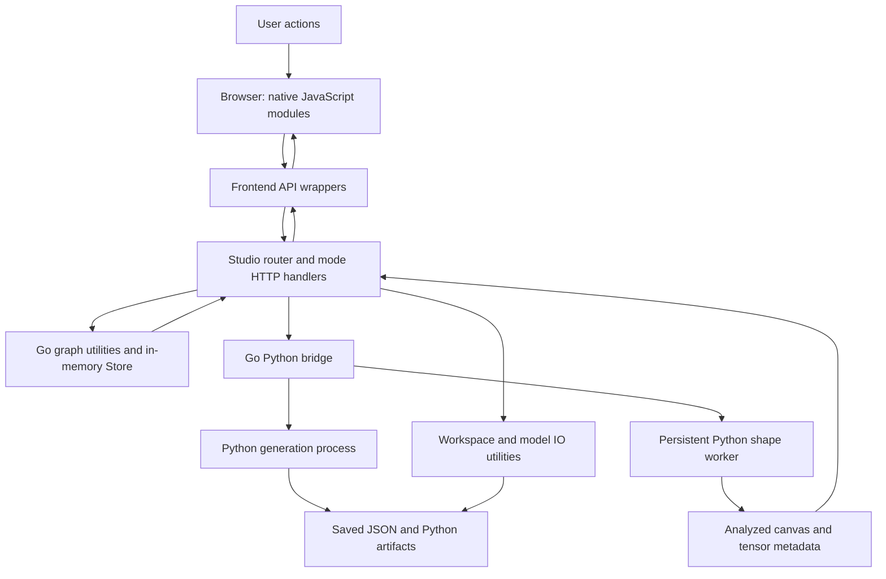
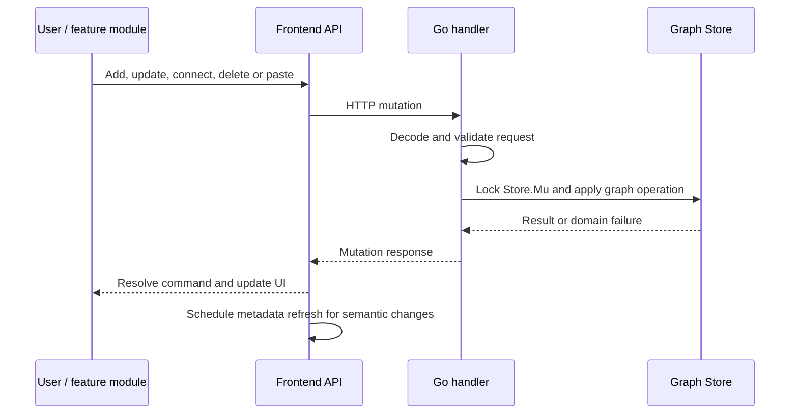
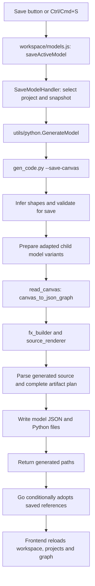

# Ein Theater: global code flow

This is the project-wide runtime guide. It follows execution from the browser to
Go, through Python, and back to the UI or saved model files. Folder documents
contain detailed component inputs/outputs, endpoint contracts and focused tests.

Ein Theater is a visual PyTorch model editor. Canvas is the only implemented mode. The studio registry also declares Data, Code,
Train and Debug as planned entries, without executable handlers.
The current application edits graphs, analyzes tensor shapes and generates model
code. Starting the server does not start model training.

## 1. Architecture and ownership



| Layer / entry | Input | Output and ownership |
| --- | --- | --- |
| `src/main.go`, `src/Canvas/canvas.go` | Mode definitions, launch directory and optional `PORT` | Independent studio router/server; default port 8080. |
| `src/studio` | Mode registry and requests | Global index/sidebar dispatch, mode catalog, namespaced API/assets and shared page responses. |
| `src/Canvas/mode` | Canvas handlers/resources | Canvas registration descriptor; no global route ownership. |
| `src/Canvas/templates` | Canvas document shells and fragments | Canvas owns both its studio-home variant and standalone page. `src/templates` is reserved for genuinely shared templates. |
| `src/static`, `src/Canvas/static` | Browser asset requests | Shared/Canvas CSS and native ES modules, served without a bundler. |
| `Canvas/static/app.js` and `js/application` | DOM readiness and user events | Application initialization and feature bindings. |
| `Canvas/static/js/api` | Feature commands and query data | HTTP calls, decoded results and scheduled shape refreshes. |
| `Canvas/handler` | HTTP requests | Validation, locking/orchestration, utility calls and HTTP responses. |
| `Canvas/utils/graph` | Project/graph commands and snapshots | In-memory edits, scoped IDs, wire geometry and metadata reconciliation. |
| `Canvas/utils/workspace`, `modelio` | Directory paths and saved artifacts | Directory listings, folder creation, decoded canvases and model port metadata. |
| `Canvas/utils/python` | Detached canvas, base directory, optional save target | Python process IO and decoded results/errors. |
| `Canvas/utils/auto_shape_fitting` | Editable graph and model references | Fitted parameters, tensor metadata, diagnostics and adapted child graphs. |
| `Canvas/utils/read_canvas` | Editable canvas | Computational graph JSON, retaining an editable `canvas` section. |
| `Canvas/utils/generate code` | Canvas/computational graph and output directory | PyTorch source, saved JSON and generated artifact paths. |
| `Canvas/utils/shared` | Module identifiers, names and graph connections | Shared constructor resolution, naming and deterministic edge ordering for Python. |

Paths beginning with `Canvas/` above are relative to `src/`.

### Expansion boundary

The studio imports no mode implementation. Entry points compose mode definitions;
Canvas exports one through Canvas/mode.Definition. Global index dispatch selects
the configured default mode, rather than searching for Canvas files. Mode callbacks
own their page/sidebar content, relative API routes and asset filesystem.

- Shared Go resource utilities live in src/utils/{paths,templates,assets}.
- Mode APIs use /api/<id>/*; assets use /static/<id>/*; pages use /<id>.
- Canvas retains flat legacy URLs for existing clients. In particular,
  /api/data is the Canvas graph endpoint, while /api/data/* belongs to future Data mode.
- GET /api/modes supplies the shared navigation module. Planned entries are
  disabled; registering a real implementation enables navigation automatically.
- A mode owns its complete page and JavaScript lifecycle. Switching modes navigates
  to another page, not merely to another sidebar inside the Canvas editor.

To add Data, Code, Train or Debug, implement its mode definition and replace its
planned entry in main.go. Do not add feature routes to Canvas or studio. See the
[mode contract and implementation checklist](src/studio/document.md), including
input/output contracts, example registration and isolation tests.

### Where state lives

- **Browser:** `js/state.js` owns the current project ID, Vis Network/datasets,
  editor mode, selection-related references and workspace UI state. It renders
  the server graph and maintains transient interaction state.
- **Go:** `handler/state.go` creates one `graph.Store`. The store owns project maps,
  tab order, active project, counters and working directory. It starts with one
  empty project. This state is shared by requests to the server, not isolated per
  browser session. Most mutations target the active project.
- **Python:** the shape worker keeps its interpreter alive across requests; each
  analysis receives a graph snapshot. It is not the owner of editable project state.
- **Disk:** save writes explicit model artifacts. Unsaved projects are in memory
  and do not survive server restart. Selecting a workspace does not save a graph.

## 2. Startup: process to first canvas

1. Run go run . in src. The composition root passes Canvas's definition
   and the four planned mode entries to studio.NewHandler, then starts the server.
   Standalone Canvas registers just Canvas with Standalone:true.
2. Studio registers index, mode catalog, sidebar dispatch, shared static files and
   each available mode's page/API/asset namespace. Canvas APIs come from its private
   registrar. Global assets and legacy Canvas assets are explicitly composed.
3. At /, studio.IndexHandler selects the default mode's Home (studio) or Page
   (standalone). Canvas Home composes Canvas/templates/studio.html; Canvas Page
   composes Canvas/templates/canvas.html. Shared composition rejects missing or
   cyclic includes before sending partial content.
4. The browser loads `/static/app.js`. It imports application event handlers and
   runs `initApp` immediately or after `DOMContentLoaded`.
5. `js/application/bootstrap.js` initializes schemas and dropdowns. If a sidebar
   is absent, it invokes the sidebar loader; otherwise it renders the palette,
   initializes workspace/project UI and enables palette drag-and-drop.
6. `js/graph/loading.js::loadGraph` requests `/api/data?analyze=false`, prepares
   node/edge datasets and initializes the network. A load version rejects older
   loads that finish after a newer one.
7. The UI records the project ID, schedules background shape refresh, and binds
   canvas interactions, selection, context menus, clipboard and the save shortcut.

**Output:** an interactive canvas appears before Python shape analysis finishes.

## 3. Editing: user command to stored graph



Feature modules live under `js/graph`, `modes`, `modals`, `clipboard`, `selection`,
`contextMenu` and `circuit`. The stable `js/api.js` facade composes request groups
from `js/api/*`; feature code does not call Python directly.

| Action | HTTP boundary | Task implementation | Result |
| --- | --- | --- | --- |
| Add/update/delete block | `node_handlers.go` | `graph/nodes.go`, `project.go`, `naming` | Scoped node ID or changed graph; incident edges are removed on deletion. |
| Connect/update/delete wire | `edge_handlers.go` | `graph/edges.go`, `geometry.go` | Validated connection and orthogonal line segments. |
| Drag blocks | Single/batch move endpoints | `graph/nodes.go`; frontend `graph/dragging.js` and circuit geometry | Updated coordinates; batch node moves preserve wire routes, which can be updated separately. |
| Paste copied graph | `PasteGraphHandler` | `graph/clipboard.go` | New IDs, remapped copied parents, shifted/snapped nodes and offset internal wires. |
| Clear graph | `ClearGraphHandler` | `graph/lifecycle.go` | Empty active graph with reset counters. |
| Create/switch/delete project | `project_handlers.go` | `graph/projects.go`, `store.go` | Updated active project and ordered tab summaries. |

Mutation completion does not wait for automatic shape inference. Position and
wire-routing edits do not schedule semantic analysis. Detailed query/JSON formats
and status codes are in the [handler contract](src/Canvas/handler/document.md).

## 4. Shape analysis: snapshot to derived metadata

1. `js/api/shapeRefresh.js` wraps semantic mutations and exposes `api.refreshShapes`.
   It debounces for 80 ms, waits for pending mutations, permits one analysis request
   in flight and coalesces later requests into a pending batch.
2. The frontend requests `/api/data?projectId=...` with analysis enabled. The
   project ID pins the request; an unknown pinned project returns 404.
3. `DataHandler` locks `Store.Mu`, prepares missing routes and captures an isolated
   JSON snapshot plus base directory. It unlocks before calling Python.
4. `utils/python.AnalyzeGraph` bypasses an empty graph. Otherwise its independent
   worker mutex serializes JSON-lines exchanges with
   `auto_shape_fitting/shape_inference.py --worker`.
5. The worker receives `{graph, baseDir}`. `shape_engine.py` orders dependencies,
   checks graph structure and evaluates shapes using the FX/meta-tensor machinery.
   Adapters fit supported constructor parameters; integrated-model handling can
   recursively analyze saved child canvases. `shared/module_registry.py` supplies
   constructor resolution; `shared/graph_order.py` supplies edge ordering.
6. Python returns `{graph}` or `{error}`. An analyzed graph contains updated params,
   `tensorInfo` and optional `adaptedModel`. The Go worker has a 45-second exchange
   timeout and stops/restarts after transport failure, bad JSON or timeout.
7. Go reacquires `Store.Mu`. `ApplyAnalysis` accepts results only if semantic inputs
   still match the original snapshot. It updates metadata/params while preserving
   the current positions and wire routes, then returns the current graph.
8. The frontend checks mutation version, dataset identity and project ID before
   updating existing dataset entries. It does not rebuild the network for metadata.

**Concurrency rule:** graph utilities rely on the caller holding `Store.Mu`.
Filesystem and Python work happen outside the lock. Backend snapshot comparison
protects newer graph edits; frontend version checks protect the displayed canvas.
A drag alone does not invalidate inference, but a parameter/topology edit does.

**Failure behavior:** the data handler preserves the graph and reports Python
unavailability in node diagnostics. Background fetch failures are logged by the
frontend. `Server-Timing` exposes snapshot and analysis durations. Snapshot-only
requests never enter the worker.

## 5. Save: editable graph to executable artifacts



- **Frontend input:** active project ID and selected working directory. Without a
  workspace, the UI opens folder selection instead of starting save.
- **Go handoff:** `SaveModelHandler` sanitizes the project name, snapshots under the
  lock, validates the output directory, then runs a separate generation process.
  The canvas travels on stdin; target/base directories are command arguments.
- **Python orchestration:** `generate code/model_storage.py::save_model_to_folder`
  deep-copies input, performs fresh inference and validation, prepares adapted child
  variants, converts the canvas and renders code. `source_renderer.py` uses
  `fx_builder.py` to construct an FX graph and produce `nn.Module` source.
- **File output:** `<workspace>/<name>/<name>.json` and `<name>.py`, with adapted
  child artifacts when needed. JSON carries computational information and editable
  canvas data. Saved references are made relative to artifact folders where applicable.
- **Write behavior:** Python prepares the compilation plan and parses generated
  source before writing artifacts. The subsequent filesystem writes are sequential;
  this is not a transactional filesystem commit.
- **Reconciliation:** Go reads the saved canvas and adopts generated integration
  references only if the original semantic snapshot still matches. Newer edits survive.
- **Frontend completion:** refresh workspace files, projects and graph, then show
  status. The bridge returns parsed JSON or the existing raw-output fallback.

Generation errors return HTTP 500; missing/invalid save directories return 400.
Unlike shape exchange, generation currently has no explicit subprocess timeout.
Save generates source; it does not train the generated network.

## 6. Load, inspect and integrated models

### Load a saved model

`workspace/models.js::loadModelFromFolder` → API load request → `LoadModelHandler`
→ `utils/modelio.Load` → `graph.Store.ImportGraph` → project/graph UI refresh.

`Load` checks the directory and matching JSON/Python companions, including sanitized
filename fallbacks. It accepts a wrapped `canvas` object or legacy graph JSON.
Under the store lock, `ImportGraph` reuses an empty or same-name project where
possible, otherwise creates a project. It restores nodes/edges, labels, ordering,
relative model/weight references and missing geometry. The response contains model
name, project ID and counts. Loading JSON does not execute the Python companion.

### Inspect or add an integrated model

Workspace browsing marks model folders. The inspect endpoint uses `modelio.Inspect`
to read saved input/output port metadata. `js/graph/integrated.js` uses inspection
results to create an integrated block referencing the model folder. Subsequent
shape requests use the Python integrated-model flow to adapt child canvases; saving
can materialize those adapted variants. Inspection itself reports saved metadata
and defaults, not a fresh shape inference result.

### Workspace navigation

Workspace handlers resolve query/body input and active-directory fallbacks, then
call `utils/workspace` for browsing, folder creation or native selection. Confirmed
selection updates Go workspace state; cancelling the Windows native picker leaves
it unchanged. Workspace changes and model saving are separate operations.

## 7. Code-reading map

Read in execution order rather than reading every file in a folder:

| Question | Start here | Detailed guide |
| --- | --- | --- |
| How does the server start? | `src/main.go`, `src/studio/routes.go`, `src/Canvas/mode/mode.go` | [Source map](src/document.md) |
| How is the first page rendered? | `src/studio/routes.go`, `src/studio/render.go`, `Canvas/handler/page_handlers.go` | [Templates](src/utils/templates/document.md) |
| How does browser initialization work? | `static/app.js`, `js/application/bootstrap.js` | [Frontend architecture](src/Canvas/static/js/document.md) |
| Where does an edit go? | `js/api.js`, `js/api/*`, matching handler, `utils/graph/*` | [HTTP contracts](src/Canvas/handler/document.md), [graph operations](src/Canvas/utils/graph/document.md) |
| Why is analysis asynchronous? | `js/api/shapeRefresh.js`, `handler/graph_handlers.go`, `utils/python/shapes.go` | [Frontend API](src/Canvas/static/js/api/document.md), [Go bridge](src/Canvas/utils/python/document.md) |
| Where are shape rules implemented? | `auto_shape_fitting/shape_engine.py`, `shape_interpreter.py`, `adapters.py` | [Shape engine](src/Canvas/utils/auto_shape_fitting/document.md) |
| How are model files produced? | `generate code/gen_code.py`, `model_storage.py`, `source_renderer.py`, `fx_builder.py` | [Generation](src/Canvas/utils/generate%20code/document.md) |
| How is canvas data converted? | `read_canvas/canvas.py` and its input/layer/graph helpers | [Conversion](src/Canvas/utils/read_canvas/document.md) |
| How are model files restored? | `handler/model_handlers.go`, `utils/modelio`, `utils/graph/import.go` | [Model IO](src/Canvas/utils/modelio/document.md) |
| Where are other utilities documented? | `src/Canvas/utils/document.md` | [Utility category index](src/Canvas/utils/document.md) |

Short paths in this table are within `src/Canvas` unless prefixed with `src/`.

## 8. Run and verify the major flows

### Launch

Use the Go toolchain declared in `src/go.mod`. Shape analysis and generation require
`python` on PATH with PyTorch available. Node.js runs the frontend regression scripts.

From the repository root:

```powershell
Set-Location src
go run .
```

Open `http://localhost:8080`. Set `$env:PORT` before launch to override the port.
For standalone Canvas, start a separate terminal at `src/Canvas` and run `go run .`.
Do not run both on the same port simultaneously.

### Automated checks

From `src`:

```powershell
go test ./...
go vet ./...
go test -race ./...
```

The race check needs CGO and a supported C compiler. If the default build cache is
unavailable, set `$env:GOCACHE = Join-Path $env:TEMP 'ein-theater-go-cache'` first.
Go tests cover graph edits, project lifecycle, snapshots, page/static serving,
model formats and a workspace/load HTTP round trip. The worker integration test
explicitly skips without Python/PyTorch; a skip does not validate inference.

From the repository root:

```powershell
node src/static/studio/navigation.test.mjs
node src/Canvas/static/js/api.test.mjs
node src/Canvas/static/js/ui.test.mjs
node src/Canvas/static/js/performance.test.mjs
python -B -m unittest discover -s src/Canvas/utils/tests -p "test_*.py" -v
```

Expected: frontend regressions pass, and Python generation/inference regressions
pass when their dependencies are installed. See [Python test documentation](src/Canvas/utils/tests/document.md)
for fixtures, individual cases and prerequisites.

### Manual end-to-end check

1. Launch the app, add Input and Linear blocks, and connect them. The graph should
   appear promptly and then receive fitted parameter/shape metadata.
2. Drag, copy/paste and delete blocks. Verify wire geometry and scoped IDs. Switch
   project tabs and confirm each project's graph is restored.
3. Select a temporary workspace and save. Expect the named JSON/Python pair and a
   successful save notification.
4. Load that folder. Expect editable nodes, parameters, edges and resolved nested
   references; loading it again should reuse the same-name project.
5. Change parameters during analysis. Older analysis must not overwrite newer
   semantic edits; dragging alone must preserve valid metadata.

For failures, follow the boundary: browser request/response → handler validation →
Go task result → Python stderr/diagnostics → generated files. Folder guides provide
component-level input/output contracts and focused test commands.

## Navigation performance

For measured opening/switching bottlenecks, selective legacy-caption repair,
UTF-8 subprocess settings and reproduction commands, see
[Canvas performance](src/Canvas/performance.md).
