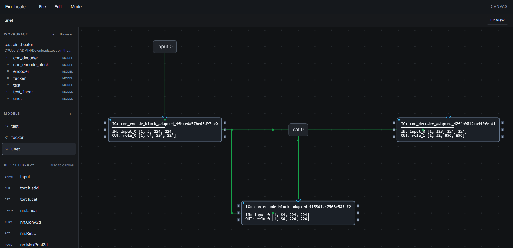

# Welcome to EinTheater

Design PyTorch models visually. Build and connect blocks on the Canvas, then save your work as editable model data and generated Python code. Data, Debug, and Code modes are on the way.



## Get started

Install Go 1.25.5 and Python with PyTorch, then run:

```powershell
cd src
go run .
```

Open **http://localhost:8080**, choose **File → Open Folder…** to set a workspace, and start creating.
