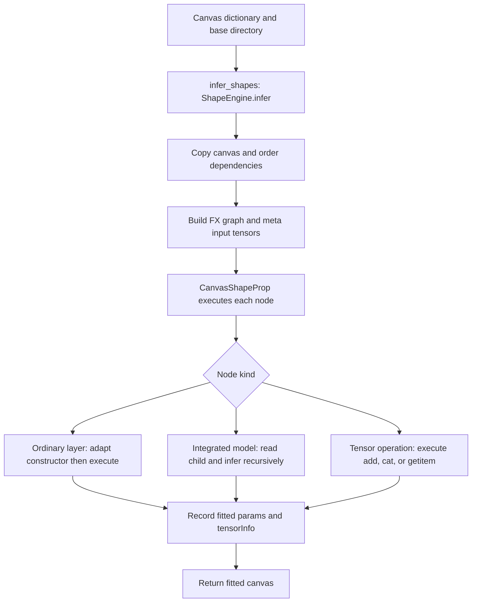

# Automatic shape fitting

This package infers tensor shapes with PyTorch meta tensors and updates constructor
parameters such as `in_features` and `in_channels`. It does not write generated files.

| Module | Responsibility |
| --- | --- |
| `shape_inference.py` | Public API and executable `main()` for stdin/worker requests |
| `shape_engine.py` | Build the inference DAG and validate connected nodes before saving |
| `shape_interpreter.py` | Execute nodes and isolate errors on independent branches |
| `adapters.py` | Built-in constructor fitting rules |
| `tensor_specs.py` | Validate input dimensions/dtypes and serialize tensor metadata |
| `integrated_models.py` | Fit nested saved canvases without modifying their source files |

## Runtime flow: canvas to fitted shapes

**Input:** `infer_shapes(canvas, base_dir='')` accepts an editable canvas dictionary
with `nodes` and `edges`, or a saved dictionary containing `canvas`. Node IDs connect
edges; `layerType` selects the operation; `params` supplies input dimensions or
constructor settings. Input dimensions exclude the batch axis. `base_dir` resolves
relative integrated-model paths. The API receives a dictionary, not a JSON string;
the CLI/worker decodes JSON before calling it.

```json
{
  "name": "Example",
  "nodes": [
    {"id": "x", "layerType": "Input", "params": {"shape": "4", "batch_size": 2}},
    {"id": "dense", "layerType": "nn.Linear", "params": {"in_features": 99, "out_features": 3}}
  ],
  "edges": [{"id": "e0", "from": "x", "to": "dense"}]
}
```



1. `ShapeEngine.infer` unwraps and deep-copies the canvas, indexes IDs, and rejects
   duplicate IDs or more than 10,000 nodes. The caller's canvas is not modified.
2. `ordered_edges` determines argument order. The engine builds incoming/successor
   lists and runs Kahn's algorithm. Missing source references, cycles, and their
   affected descendants receive diagnostics; independent branches can still run.
3. Each `Input` becomes an FX placeholder. `input_spec` resolves its shape and dtype,
   prepends batch size, and creates a meta tensor. Here, `shape="4"` and batch `2`
   produce a tensor with shape `[2, 4]`. Old `tensorInfo` and `adaptedModel` are reset.
4. `CanvasShapeProp.run_node` obtains upstream values. For an ordinary layer,
   `call_module` merges palette defaults with node parameters, resolves the class,
   and finds the first registered adapter in its class hierarchy. The Linear adapter
   changes `in_features` from `99` to `4`; `out_features=3` remains configured.
5. The interpreter filters constructor arguments, constructs the module on the meta
   device in evaluation mode, and executes it. PyTorch produces the output shape;
   the adapter does not calculate the output using a separate formula.
6. Successful execution records fitted `params`, `tensorInfo.input`, `output`,
   `outputTree`, and `auto`. For this example, the dense node has input `[2, 4]`,
   output `[2, 3]`, `auto=["in_features"]`, and an empty `message`.

**Integrated-model branch:** `infer_integrated` resolves `model_path`, checks for
recursive references and excessive nesting, then calls `read_canvas` on the child
folder. Parent arguments are matched to child Input nodes in their canvas order;
their count must match. The same engine runs recursively with those tensors as
input overrides. The child must resolve to one tensor output. If its input contract,
inferred fields, or nested adaptations change, the parent node receives
`adaptedModel`; weight references are cleared for that adapted instance. No files
are written here: the save coordinator later persists the variant.

**Output and failure behavior:** `infer_shapes` returns the copied, fitted canvas.
The lower-level `ShapeEngine.infer` returns `(canvas, values_by_id, fx_module)`.
On a node failure, the interpreter restores that node's previous parameters, clears
its output metadata, writes `tensorInfo.message`, and returns an internal
`UNRESOLVED` value. Dependent nodes fail rather than guessing dimensions. A canvas
with node diagnostics can still be returned successfully; `validate_for_save`
separately rejects diagnostics on connected nodes. Request-level exceptions become
`{"error": "..."}` in worker mode; successful worker results use `{"graph": ...}`.

## Run main: one request

Prerequisites: Python with PyTorch installed in the selected environment. Commands
below use PowerShell. Starting at the repository root:

```powershell
Set-Location 'src/Canvas/utils/auto_shape_fitting'
python -B shape_inference.py --help
$canvas = '{"name":"SmokeModel","nodes":[{"id":"x","layerType":"Input","params":{"input_type":"raw data","shape":"4","batch_size":2}},{"id":"dense","layerType":"nn.Linear","params":{"in_features":99,"out_features":3}}],"edges":[{"id":"e0","from":"x","to":"dense"}]}'
$canvas | python -B shape_inference.py
```

Expected: JSON containing `dense.params.in_features = 4` and
`dense.tensorInfo.output = [2, 3]`. The original input dimension `99` is fitted to
the incoming tensor. A per-node `tensorInfo.message` describes unresolved shapes;
inspect it even when the process exits successfully.

For a file, run `Get-Content -Raw ./canvas.json | python -B shape_inference.py`.
Use `--base-dir <folder>` to resolve relative integrated-model references.

## Run main: persistent worker

From this same directory:

```powershell
python -B -u shape_inference.py --worker
```

Paste one complete request on each line, then press Enter:

```json
{"graph":{"nodes":[{"id":"x","layerType":"Input","params":{"shape":"4","batch_size":2}}],"edges":[]},"baseDir":"."}
```

Expected: one `{"graph": ...}` response per request. Invalid JSON produces
`{"error": "..."}` and the worker continues. Press Ctrl+C to stop. `baseDir` is
provided per worker request; `--base-dir` applies to the one-request mode.

## Regression tests

From this directory:

```powershell
python -B -m unittest discover -s ../tests -p test_shape_inference.py -v
```

Tests cover meta execution, invalid inputs, cycles, constructor adaptation,
nested models, and worker recovery. For Python imports, add the parent `utils`
directory to the import path and use `auto_shape_fitting.shape_inference`.

See [utility architecture](../document.md) and [shape behavior](../../shape-inference.md).
