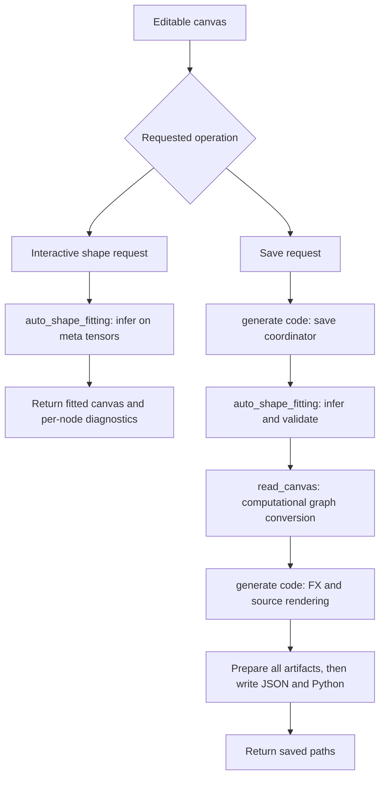

# Canvas utilities

Shared template, resource-path and asset helpers live in [src/utils](../../utils/document.md). Application routing lives in [studio](../../studio/document.md).

## Go task categories

HTTP adapters live in [handler](../handler/document.md). Go utility packages do not
import handler. Each folder guide lists component inputs/outputs, error behavior,
side effects and focused tests. Graph state is protected by Store.Mu at the caller;
filesystem and Python work run outside that lock.

| Directory | Input → output / responsibility |
| --- | --- |
| [graph](graph/document.md) | Graph commands and snapshots → project mutations, geometry and reconciled metadata. |
| [naming](naming/document.md) | Model/layer strings → valid names and node-ID prefixes. |
| [workspace](workspace/document.md) | Directory inputs → listings, created folders or native selection. |
| [modelio](modelio/document.md) | Saved model folder → decoded canvas or port metadata. |
| [python](python/document.md) | Detached canvas → Python shape analysis or generated model artifacts. |
| [fault](fault/document.md) | Failure message/classification → transport-independent task error. |

From src, run go test ./... and go vet ./.... Graph edits, HTTP contracts,
templates, static assets and filesystem fixtures run without Python. The persistent
worker integration test requires python on PATH and PyTorch; verbose output shows
an explicit skip when unavailable. See each folder's test section for commands and
expected results. Package comments in the source files provide a short ownership summary.

## Python task categories

Utilities are grouped by responsibility. New Python packages use snake_case names;
`generate code` keeps its existing name because the Go save bridge locates its CLI
by path. Files were moved, not copied; the previous fitting and parsing paths under
`generate code` no longer exist.

## Directory map

| Directory | Modules and responsibility |
| --- | --- |
| `generate code/` | `gen_code.py` and `__init__.py`: generation API; `fx_builder.py`: FX graph; `source_helpers.py`, `source_renderer.py`: Python source; `model_paths.py`, `model_storage.py`: generated artifact paths and save orchestration |
| `auto_shape_fitting/` | `shape_inference.py`: worker/API; `shape_engine.py`: inference DAG; `shape_interpreter.py`: meta execution; `adapters.py`: built-in constructor fitting; `tensor_specs.py`: validation/metadata; `integrated_models.py`: recursive model adaptation |
| `read_canvas/` | `canvas.py`: conversion API; `canvas_inputs.py`: placeholders; `canvas_layers.py`: layer metadata; `canvas_graph.py`: connections/outputs; `saved_canvas.py`: read an editable canvas from a model folder |
| `shared/` | `common.py`: naming/palette lookup; `module_registry.py`: trusted modules and shared constructor resolution; `graph_order.py`: deterministic edge ordering |
| `tests/` | Generator, inference, nested-model, CLI, and import regressions; `bootstrap.py` resolves utility paths for test discovery |

## Dependency boundaries

Parsing and fitting depend on `shared`. Fitting uses `read_canvas.saved_canvas`
to load nested models. Source generation uses the parsing package. The save
coordinator invokes fitting, conversion, and rendering before writing artifacts.
Shared code never imports fitting, parsing, or generation implementations.

The registry is shared because both generation and inference must resolve the
same constructors. Built-in fitting rules are registered by
`auto_shape_fitting.adapters` when the shape interpreter loads. Ordinary saved
canvas loading does not execute models or require the fitting engine.

## End-to-end runtime flow

There are two primary execution paths. Both start from editable canvas data
(`nodes`, `edges`, and node `params`), rather than existing Python model source.



`shared` supplies constructor resolution, naming, and ordering to both paths.
Nested fitting reads child JSON through `read_canvas.saved_canvas` and recursively
runs the inference engine. It returns adapted child canvases in memory; only saving
turns them into separate model artifacts. `tests` drives these same paths with
fixtures and checks their results. Each child document describes its own input
contract, function call order, branches, output, and error behavior below its module map.

## Entry points

Each child directory includes an English guide with folder-local commands,
expected output, and a runnable entry point or a complete `main()` example:

- [Generate code](generate%20code/document.md): save a small model and execute its generated main block.
- [Auto shape fitting](auto_shape_fitting/document.md): run one inference request or the persistent worker.
- [Read Canvas](read_canvas/document.md): run a conversion example through a Python `main()` function.
- [Shared utilities](shared/document.md): run naming, edge-order, palette, and constructor checks.
- [Tests](tests/document.md): run the whole suite, each file's main, or one regression.

Folder-local examples use PowerShell. Each `Set-Location` command assumes you start
at the repository root; open a new terminal there before following another guide.
Use an environment containing Python and PyTorch. If `python` is not on PATH,
substitute the configured interpreter (for example, `py` where available).

Run from the repository root:

```sh
python "src/Canvas/utils/generate code/gen_code.py" --save-canvas canvas.json --out-dir output
python src/Canvas/utils/auto_shape_fitting/shape_inference.py --worker
python -B -m unittest discover -s src/Canvas/utils/tests -p "test_*.py" -v
```

The Go shape bridge resolves `auto_shape_fitting/shape_inference.py` next to the
generation directory. Both scripts locate sibling packages independently of the
current working directory. Python callers can place `src/Canvas/utils` on their
import path and import `read_canvas.canvas`, `auto_shape_fitting.shape_inference`,
or `shared.module_registry`. Use the documented dynamic loader for the generation
directory, whose existing name contains a space.

See [generation and saving](generate%20code/document.md),
[shape fitting](../shape-inference.md), and [Canvas architecture](../document.md).
