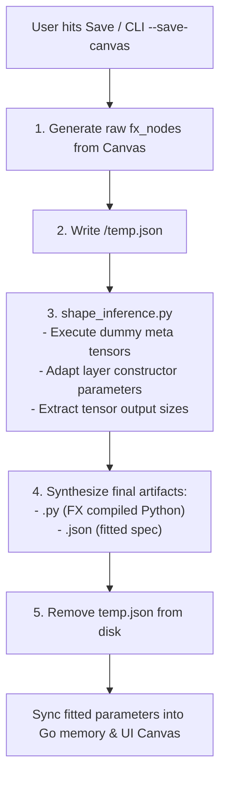

# PyTorch Code Generation Engine

The **PyTorch Code Generation Engine** (`src/Canvas/utils/generate code/`) is the central compilation pipeline responsible for translating the visual, node-based Canvas representation into fully executable, production-ready PyTorch code (`nn.Module`).

---

## 1. Internal Architecture & Pipeline

The pipeline is split into three core modules, executed dynamically via the `gen_code.py` orchestrator:

1. **Canvas to Graph Parser (`canvas.py`)**:
   - Accepts the raw visual JSON payload (`nodes`, `edges`).
   - Resolves node identities, handles dynamic connection tracking, and parses visual topologies into an intermediate sequence of operational FX-like nodes.
   - Outputs a unified standard graph format (`canvas_to_json_graph(canvas_data)`).
2. **Python Shape Adaptation (`shape_inference.py`)**:
   - Uses a persistent JSON-lines Python worker executing dummy tensors on PyTorch's meta device.
   - Automatically infers tensor dimensions and matches downstream layer constraints (e.g. `in_features`, `in_channels`).
   - Retrieves the exact tensor shape for every intermediate node without allocating real memory or blocking the UI.
3. **FX Graph & Source Synthesizer (`codegen.py`)**:
   - Parses the corrected JSON and builds a true `torch.fx.Graph`.
   - Iterates over the graph sequentially mapping operations (`call_module`, `placeholder`, `call_function`, `output`, `accumulate`).
   - Dynamically parses class constructor formats from `modules.json` templates using string `format()`.
   - Synthesizes the exact PyTorch `forward()` pass using PyTorch's native FX compiler (`graph.python_code(root_module="self").src`).
   - Post-processes the compiled source code, injecting automated tensor shape comments tracked by the shape-fitting engine.

---

## 2. The Code Generation Output (`<ModelName>.py`)

The engine generates standalone, highly readable Python code.

### Synthesized Forward Pass with Automated Shapes
Because we track shapes mathematically through the auto-fit engine, the generator injects helpful dimension comments right before execution:

```python
    def forward(self, x0):
        # conv_1 shape: [1, 64, 224, 224]
        conv_1 = self.conv_1(x0);  x0 = None
        
        # relu_1 shape: [1, 64, 224, 224]
        relu_1 = self.relu_1(conv_1);  conv_1 = None
        
        return relu_1
```

### Integrated Test Suite (`if __name__ == '__main__':`)
The generator automatically builds an execution test block at the bottom of the file. It detects the incoming tensor modalities (Image, Text, Audio, Custom) and creates correctly typed `torch.randn` or `torch.randint` inputs.

```python
if __name__ == '__main__':
    print("Testing NestedModel...")
    model = NestedModel()
    
    x0 = torch.randn([1, 3, 224, 224])
    
    try:
        output = model(x0)
        print("Forward pass successful!")
        print("Output shape:", output.shape)
    except Exception as e:
        print("Forward pass failed:", e)
```

---

## 3. Supported Input Modalities & Dummy Generation

| Modality | Default Preset | Tensor Dtype | Sample Dummy Tensor |
| :--- | :--- | :--- | :--- |
| **`image`** | `3, 224, 224` | `torch.float32` | `torch.randn(B, C, H, W)` |
| **`text`** | `128` | `torch.int64` | `torch.randint(0, 100, (B, T))` |
| **`audio`** | `1, 16000` | `torch.float32` | `torch.randn(B, C, L)` |
| **`raw data`** | `64` | `torch.float32` | `torch.randn(B, D)` |
| **`custom`** | Custom | Configurable | Dimension-matching tensor |

---

## 4. Save Pipeline Lifecycle

When a model is saved (via the UI **Save** button / `Ctrl+S` or CLI `--save-canvas`), the system executes a deterministic 5-step lifecycle:



---

## Programmatic Usage in Python

```python
import importlib.util
from pathlib import Path

# Resolve path to gen_code.py
gen_code_path = Path(__file__).resolve().parent / "gen_code.py"

spec = importlib.util.spec_from_file_location("gen_code", gen_code_path)
gen_code = importlib.util.module_from_spec(spec)
spec.loader.exec_module(gen_code)

# Generate PyTorch code from canvas JSON data dict
# Using the CLI entry point
gen_code.save_model_to_folder(canvas_data, output_dir="./output_folder")
```

---

## Related Documentation

- [Canvas Subsystem Documentation](../../document.md) — Comprehensive overview of the Canvas mode architecture.
- [Root Documentation](../../../../document.md) — Main overview of Ein Theater.
- [Python Shape Adaptation](../../shape-inference.md) — Documentation on Python shape adaptation and meta tensor execution.
