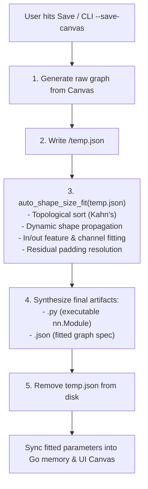

# PyTorch Code Generation Engine (`src/Canvas/utils/generate code`)

This directory contains the core symbolic graph tracing, connection classification, and PyTorch AST code generation engine for **Ein Theater**.

The engine is encapsulated in [`gen_code.py`](./gen_code.py). It serves as both a standalone CLI compiler and the execution backend invoked by the Go web server (`SaveModelHandler`) to generate clean, production-ready PyTorch `nn.Module` models from visual canvas graphs.

---

## Architecture & Pipeline

```
Visual Canvas Graph (JSON)  ──►  Stdin / File
                                      │
                                      ▼
                        ┌───────────────────────────┐
                        │   gen_code.py Compiler    │
                        ├───────────────────────────┤
                        │ 1. Schema Validation      │
                        │    (Canvas/data/modules.json)
                        │ 2. Topological Sort       │
                        │ 3. Connection Semantics   │
                        │ 4. AST Python Code Synth  │
                        └─────────────┬─────────────┘
                                      │
              ┌───────────────────────┴───────────────────────┐
              ▼                                               ▼
     <model_name>.json                               <model_name>.py
 (Graph schematic & metadata)                    (Executable PyTorch nn.Module)
```

### Modular Architecture

To ensure high maintainability, clean separation of concerns, and readability, the engine is partitioned into dedicated single-responsibility submodules orchestrated through `gen_code.py`:

| Module | Primary Responsibility |
| :--- | :--- |
| [`common.py`](./common.py) | Model identifier sanitization (`fix_model_name`) and dynamic `modules.json` schema location/loading (`load_modules_map`). |
| [`classifier.py`](./classifier.py) | Symbolic FX node inspection (`is_addition_node`, `is_concat_node`, etc.), connection classification (`classify_connection`), and graph summary table printer (`inspect_model_graph`). |
| [`tracer.py`](./tracer.py) | PyTorch `nn.Module` layer parameter extraction (`get_module_params`), argument serialization (`arg_to_str`), and FX model tracing to JSON graph (`model_to_json_graph`). |
| [`canvas.py`](./canvas.py) | Compiles visual schematic canvas JSON into FX computational graph JSON (`canvas_to_json_graph`), topological Kahn's sorting with spatial ordering, and connection flow synthesis. |
| [`codegen.py`](./codegen.py) | AST Python source code synthesis (`generate_code_from_json`, `generate_code_from_canvas`) and model directory packaging (`save_model_to_folder`). |
| [`__init__.py`](./__init__.py) | Package initialization exposing the public API. |
| [`gen_code.py`](./gen_code.py) | Unified façade and CLI compiler preserving 100% backward compatibility for the Go backend and external CLI invocations. |

---


## Command-Line Interface (CLI)

`gen_code.py` can be executed directly from the terminal or invoked via child process pipes.

### Syntax

```bash
python "src/Canvas/utils/generate code/gen_code.py" [OPTIONS]
```

### Options

| Flag | Argument | Description |
| :--- | :--- | :--- |
| `--save-canvas` | `<file_path>` or `-` | Reads canvas JSON from `<file_path>` or standard input (`-`), compiles the PyTorch model script and JSON specification, and saves them to `<out-dir>/<model_name>/`. Outputs JSON status to stdout. |
| `--canvas-json` | `<json_string>` | Parses raw canvas JSON string directly from the CLI argument, compiles and saves the model package to `<out-dir>/<model_name>/`. Outputs JSON status to stdout. |
| `--out-dir` | `<directory>` | Target output directory where `<model_name>/` subfolder will be created (default: `./outputs`). |
| `--help`, `-h` | None | Displays help message with command options. |


### CLI Examples

1. **Compile canvas JSON file to target directory**:
   ```bash
   python "src/Canvas/utils/generate code/gen_code.py" --save-canvas my_canvas.json --out-dir C:/my_models
   ```
   *Generates:*
   - `C:/my_models/<model_name>/<model_name>.json`
   - `C:/my_models/<model_name>/<model_name>.py`

2. **Compile via standard input pipe (as done by Go backend)**:
   ```bash
   cat my_canvas.json | python "src/Canvas/utils/generate code/gen_code.py" --save-canvas - --out-dir ./workspace
   ```

3. **Compile from inline JSON string**:
   ```bash
   python "src/Canvas/utils/generate code/gen_code.py" --canvas-json "{\"name\": \"my_model\", \"nodes\": [], \"edges\": []}" --out-dir ./workspace
   ```

---


## Integration with the Go Backend

When a user triggers **Save Model** (`Ctrl+S` or workspace button) in the Ein Theater UI:

1. The frontend sends `POST /api/workspace/save-model` with the current workspace directory and project ID.
2. The Go backend (`src/Canvas/handler/workspace_handlers.go`: `SaveModelHandler`) locates `gen_code.py` using `findGenCodePyPath()`.
3. It spawns the compiler subprocess:
   ```go
   cmd := exec.Command("python", genCodePyPath, "--save-canvas", "-", "--out-dir", cleanTarget)
   cmd.Stdin = strings.NewReader(string(canvasBytes))
   ```
4. `gen_code.py` emits a JSON result status to stdout:
   ```json
   {
     "status": "ok",
     "folder": "C:/path/to/workspace/my_model",
     "folderName": "my_model",
     "jsonFile": "C:/path/to/workspace/my_model/my_model.json",
     "pyFile": "C:/path/to/workspace/my_model/my_model.py",
     "modelName": "my_model"
   }
   ```
5. The Go handler responds to the frontend, which displays a notification toast confirming the save.

---

## Programmatic Usage in Python

Because the folder name contains a space (`generate code`), load the module dynamically using Python's `importlib.util`:

```python
import importlib.util
from pathlib import Path

# Resolve path to gen_code.py
gen_code_path = Path(__file__).resolve().parent / "gen_code.py"

spec = importlib.util.spec_from_file_location("gen_code", gen_code_path)
gen_code = importlib.util.module_from_spec(spec)
spec.loader.exec_module(gen_code)

# Generate PyTorch code from canvas JSON data dict
code = gen_code.generate_code_from_json(canvas_data)
print(code)
```

---

## Module Definitions Resolution

`gen_code.py` resolves layer definitions from `modules.json` by inspecting candidate relative paths dynamically (`src/Canvas/data/modules.json`, `src/Canvas/static/data/modules.json`, etc.), allowing it to be executed from any current working directory (repository root, `src/`, or external test runners).

---

## Input Block & Modality Shape Configuration

Ein Theater supports an explicit **`Input`** source block on the canvas with customizable modalities and shapes:

### Supported Modalities & Presets

| Modality | Default Preset | Common Presets | Tensor Dtype | Sample Dummy Tensor |
| :--- | :--- | :--- | :--- | :--- |
| **`image`** | `3, 224, 224` | `3, 224, 224` (ImageNet / ViT)<br>`3, 256, 256` (High-Res Vision)<br>`3, 32, 32` (CIFAR)<br>`1, 28, 28` (MNIST Grayscale) | `torch.float32` | `torch.randn(B, C, H, W)` |
| **`text`** | `128` | `128` (Short Sequence)<br>`256` (Medium Sequence)<br>`512` (Standard BERT / NLP)<br>`1024` (Long Context) | `torch.int64` | `torch.randint(0, 1000, (B, T))` |
| **`audio`** | `1, 16000` | `1, 16000` (1 sec @ 16 kHz Mono)<br>`1, 44100` (1 sec @ 44.1 kHz CD Quality)<br>`2, 44100` (1 sec Stereo) | `torch.float32` | `torch.randn(B, C, L)` |
| **`raw data`** | `64` | `64` (Tabular / 64 Features)<br>`128` (128 Features)<br>`32` (32 Features)<br>`10` (10 Features) | `torch.float32` | `torch.randn(B, D)` |
| **`custom`** | Custom | User-defined comma-separated shape (e.g. `1, 28, 28` or `3, 64, 64`) | Configurable | Dimension-matching tensor |

### Code Generation Pipeline Behavior

1. **Placeholder Representation**: When an `Input` block is present in the visual graph, `canvas_to_json_graph` generates an FX `placeholder` node rather than a `call_module` block (ensuring it is not mistakenly instantiated as a submodule in `__init__`).
2. **Forward Parameter Signatures**: Assigns clean parameter names in `def forward(self, ...)` (e.g., `image`, `text`, `audio`, or `x`), with descriptive shape comments.
3. **Automated Forward Testing**: When `<model_name>.py` is saved via `save_model_to_folder`, the `if __name__ == '__main__':` block automatically generates synthetic sample tensors matching the chosen modality, dimensions, and data type, executing a test forward pass and printing output tensor shapes.

---

## Connection Types, Special Edge Ordering & Selective Indexing

1. **Connection Types**: Connections between layers are classified into:
   - **`normal`** (default): Standard feedforward dataflow between layers. Rendered with clean green electrical traces without index badges.
   - **`residual`**: Additive shortcut connection (e.g. ResNet residual connection). Rendered in vibrant purple (`#a855f7`) with a `RES <index>` badge.
   - **`skip`**: Concatenation bypass connection (e.g. U-Net skip connection). Rendered in cyan (`#06b6d4`) with a `SKIP <index>` badge.
2. **Selective Indexing (Special Edges Only)**:
   - Normal feedforward connections are unindexed (`index: null`) to prevent schematic clutter.
   - Only special connections (`residual`, `skip`) receive contiguous 0-based indices (`0, 1, 2...`).
3. **Special Edges Placed Behind All Normal Edges**:
   - In graph representation, canvas data, and forward execution order, **all special edges are placed behind all normal edges**.
   - This ensures the feedforward backbone executes first, after which residual and skip bypass branches converge into the downstream target layers.
4. **Interactive Controls**:
   - Right-click an edge to open the Context Menu -> **Connection Type ▶** (`Normal Flow`, `Residual Connection`, `Skip Connection`).
   - Press **`T`** or **`t`** with an edge selected to cycle connection types (`normal` -> `residual` -> `skip` -> `normal`).
5. **Code Annotations in Generated Code**:
   - Normal feedforward calls remain clean without distracting comments.
   - Special connections are explicitly annotated with their type and index:
   ```python
   # Residual Edge #0: conv 0 -> residual add
   add_0 = add_0 + conv_c0
   ```

---

## Save Pipeline & Auto Shape Size Fit Integration

When saving a canvas model (via the UI **Save** button / `Ctrl+S` or CLI `--save-canvas`), the system executes a deterministic 5-step lifecycle:



1. **Step 1 (`temp.json` Creation)**: The raw computational graph from the active canvas is serialized and written to `<target_folder>/temp.json`.
2. **Step 2 (Auto Shape Size Fit Execution)**: `auto_shape_size_fit` is invoked directly on `temp.json`. It topologically sorts graph nodes, propagates tensor dimensions from input placeholders, auto-fits layer parameters (`in_features`, `in_channels`, `embed_dim`), auto-resolves spatial padding on skip/residual connections via the mathematical padding solver, and synchronizes canvas node metadata.
3. **Step 3 (Final Code & JSON Generation)**: Only after all shapes and paddings are completely fitted, the final AST Python code (`<model_name>.py`) and final model specification (`<model_name>.json`) are generated and written to disk.
4. **Step 4 (`temp.json` Cleanup)**: `temp.json` is deleted from disk.
5. **Step 5 (In-Memory & UI Synchronization)**: The Go backend (`SaveModelHandler`) synchronizes the auto-fitted node parameters back into the active project in memory, and the client frontend reloads the graph, displaying updated dimensions in the node cards and an informative toast notification.

---

## Related Documentation

- [Canvas Subsystem Documentation](../../document.md) — Comprehensive overview of the Canvas mode architecture.
- [Root Documentation](../../../../document.md) — Main overview of Ein Theater.
- [Backend Handler Documentation](../../handler/document.md) — Detailed Go backend architecture, concurrency model, and REST handlers.
- [Frontend JavaScript Documentation](../../static/js/document.md) — Client-side ES6 architecture and Vis.js/Canvas rendering pipeline.
- [Auto Shape Size Fit Engine](../auto%20shape%20size%20fit/document.md) — Automated tensor shape propagation, dimension inference, and skip/residual padding auto-resolution engine.
