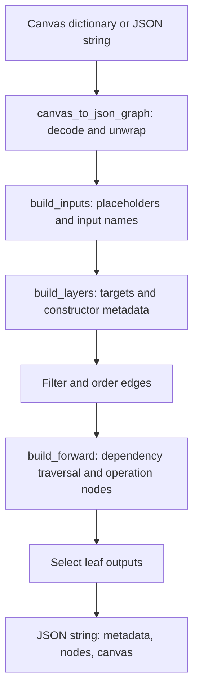

# Canvas reading and graph conversion

This package reads editable Canvas JSON and converts visual nodes/connections
into computational nodes. Conversion does not run shape fitting or save artifacts.

| Module | Responsibility |
| --- | --- |
| `canvas.py` | `canvas_to_json_graph`: Canvas dictionary/JSON string to graph JSON string |
| `canvas_inputs.py` | Recognize inputs and normalize placeholder names/metadata |
| `canvas_layers.py` | Resolve layer targets and constructor metadata |
| `canvas_graph.py` | Traverse connections and select forward outputs |
| `saved_canvas.py` | `read_canvas(folder)`: load the editable canvas from a saved model |

`read_canvas(folder)` looks for `<folder-name>.json`, then the sanitized name. It
accepts a saved `canvas` wrapper or a raw canvas and requires editable layer types.
Graph conversion uses PyTorch constructor information through the shared registry;
the saved-JSON reader itself does not execute PyTorch models.

## Runtime flow: visual canvas to computational graph

**Input:** `canvas_to_json_graph(canvas_data)` accepts a dictionary or JSON string.
The visual canvas contains `nodes` (`id`, `layerType`, `params`, optional coordinates)
and `edges` (`id`, `from`, `to`). A saved document may wrap the visual payload in
`canvas`. This is visual graph data, not tensor values or Python model source.



1. `canvas_to_json_graph` decodes strings, reads the visual payload, loads palette
   definitions, and sanitizes the model name. An empty canvas returns a default
   placeholder graph immediately.
2. `build_inputs` recognizes Input blocks, chooses unique Python variable names,
   and carries shape, dtype, batch, and modality metadata into `placeholder` nodes.
   If the canvas has no explicit input, it inserts the default `x` placeholder.
3. `build_layers` assigns unique module targets and combines palette defaults with
   node parameters. Ordinary `nn.*` constructors use shared constructor resolution;
   integrated nodes carry their child model name, path, and weight metadata.
4. Edges with missing endpoints or self-connections are filtered out. The remaining
   edges use numeric edge-ID order, which determines each node's incoming arguments.
5. `build_forward` traverses dependencies, prioritizing inputs and then coordinates
   among ready nodes. Ordinary layers produce `call_module`; add, concatenate, and
   tensor selection produce `call_function`. Output blocks forward their source
   variable. Disconnected layers retain constructor metadata with `in_forward=False`.
6. Non-input leaf variables become the final `output` operation. Without valid
   edges, modules are retained but no forward calls are forced into the graph.

**Example transformation:** visual `Input(x) -> ReLU(relu)` becomes computational
`placeholder -> call_module -> output`. Each operation references upstream
computational IDs in `inputs`; a layer also carries its constructor template and
parameters. The return value is a JSON **string** containing `metadata`, `nodes`,
and `canvas`. Call `json.loads(...)` to inspect it as a dictionary.

This conversion does not fit dimensions or execute the model. Unlike the inference
engine, its traversal appends remaining nodes when a cycle prevents a full ordering;
it is not a cycle validator. The save pipeline runs inference/validation first.
Conversion may replace the supplied dictionary's top-level `edges` with sorted
edges; callers needing an untouched dictionary should pass a copy.

## Runtime flow: saved folder to editable canvas

`saved_canvas.read_canvas(folder)` is a separate read-only path:

1. Resolve the folder and require it to exist.
2. Look for `<folder-name>.json`, falling back to the sanitized model filename.
3. Decode UTF-8 JSON (including a possible BOM), then select `data['canvas']` when
   present, otherwise the raw document.
4. Require nonempty nodes with `layerType`, supply a missing model name, and return
   the editable canvas **dictionary**.

Missing files, malformed JSON, or non-editable model data raise exceptions. This
function neither imports the saved `.py` model nor fits its shapes; nested shape
fitting calls it before recursively analyzing the returned canvas.

## Run a main example

This is a library package; it has no CLI `main.py`. The following complete example
defines and runs `main()` without adding a temporary source file. Use PowerShell
with Python and PyTorch available. Starting at the repository root:

```powershell
Set-Location 'src/Canvas/utils/read_canvas'
@'
import json
import sys
from pathlib import Path

sys.path.insert(0, str(Path.cwd().parent))
from read_canvas.canvas import canvas_to_json_graph


def main():
    canvas = {
        "name": "SmokeModel",
        "nodes": [
            {"id": "x", "layerType": "Input", "params": {"shape": "4"}},
            {"id": "relu", "layerType": "nn.ReLU", "params": {}},
        ],
        "edges": [{"id": "e0", "from": "x", "to": "relu"}],
    }
    graph = json.loads(canvas_to_json_graph(canvas))
    operations = [node["op"] for node in graph["nodes"]]
    assert operations == ["placeholder", "call_module", "output"]
    print("Canvas conversion OK:", operations)


if __name__ == "__main__":
    main()
'@ | python -B -
```

Expected: `Canvas conversion OK: ['placeholder', 'call_module', 'output']`.
To inspect an existing model instead, import `read_canvas` from
`read_canvas.saved_canvas` and pass the model folder, not its `.py` or `.json` file.

## Integration tests

From this directory:

```powershell
python -B -m unittest discover -s ../tests -p test_codegen.py -v
```

These tests exercise parsing through source generation, including disconnected
layers and the save CLI. See [utility architecture](../document.md).

## Legacy nested-model captions

`saved_canvas.repair_legacy_labels(canvas)` repairs inflated, encoding-corrupted
IntegratedModel captions in place, including adapted children. read_canvas invokes
it after file decoding. It returns no value and changes no parameters or source
files. See [performance](../../performance.md). From the repository root run:

```powershell
python -B -m unittest discover -s src/Canvas/utils/tests -p test_saved_canvas_labels.py -v
```

This regression needs Python but not PyTorch.
