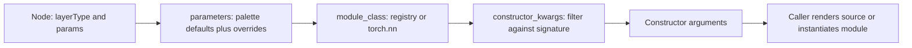

# Shared utility contracts

This package holds logic used by both graph conversion and shape fitting. It does
not import either pipeline or run a worker.

| Module | Responsibility |
| --- | --- |
| `common.py` | Model/input naming and `modules.json` discovery/loading |
| `module_registry.py` | Trusted module registration, palette defaults, literal parsing, constructor resolution |
| `graph_order.py` | Stable numeric ordering of edge IDs |

The registry owns `register_module` and `register_adapter`. Built-in fitting rules
live in `auto_shape_fitting/adapters.py` and load with the shape interpreter.
Registering a custom module here does not create imports in generated source.

## Runtime flow: shared requests from the pipelines

This package has no single application workflow. Parsing, fitting, and saving call
its functions with small values. The main constructor-resolution path is:



| Function | Input | Processing and output |
| --- | --- | --- |
| `fix_model_name` / `fix_input_name` | User label; optional input index | Apply naming rules and return a Python-oriented name; input naming also handles default labels and reserved keywords |
| `find_modules_json_path` | No arguments | Probe repository-relative and working-directory paths; return the first existing palette path or `None` |
| `load_modules_map` | No arguments | Read palette JSON and index definitions by `type`; return a dictionary, or `{}` if loading fails |
| `parameters` | Node dictionary | Read cached palette defaults, parse literal values, apply node overrides, and return merged parameters |
| `module_class` | Type string such as `nn.Linear` | Check explicitly registered modules, then `torch.nn`; return an `nn.Module` class or raise for an unsupported type |
| `constructor_kwargs` | Module class and parameters | Inspect `__init__`, retain accepted keywords (or all if `**kwargs` is supported), always exclude `customArgs`; return a dictionary |
| `ordered_edges` | List of edge dictionaries | Sort by numeric suffix for `e<number>` IDs, otherwise original position; use original position to break ties; return a new ordered list |

For example, a Linear node with `out_features=3` receives palette defaults before
its explicit parameters override them. During fitting, an adapter then replaces
`in_features` using the incoming tensor; during generation, constructor filtering
keeps that fitted value. Sharing resolution prevents the two callers from choosing
different constructor fields. These helpers do not independently execute a forward
pass or write files.

**Registration flow:** `register_module(name, cls, adapter)` stores the trusted
class and optional adapter in process-local dictionaries. `register_adapter`
associates classes with callbacks. The fitting interpreter searches the class MRO
for a callback and calls it with `(params, input_tensors)`. The callback returns
constructor updates, such as `{'in_features': 4}`; the interpreter applies those
updates and executes PyTorch. Palette schemas are cached after their first lookup
in that process, while explicit registrations remain in memory for subsequent calls.

## Run a main example

This library has no standalone CLI. Use the following `main()` smoke example with
Python and PyTorch installed. Commands use PowerShell, starting at the repository root:

```powershell
Set-Location 'src/Canvas/utils/shared'
@'
import sys
from pathlib import Path

sys.path.insert(0, str(Path.cwd().parent))
from shared.common import fix_model_name, load_modules_map
from shared.graph_order import ordered_edges
from shared.module_registry import constructor_kwargs, module_class


def main():
    assert fix_model_name("Demo Model") == "Demo_Model"
    edges = ordered_edges([{"id": "e10"}, {"id": "e2"}])
    assert [edge["id"] for edge in edges] == ["e2", "e10"]
    assert "nn.Linear" in load_modules_map()
    kwargs = constructor_kwargs(module_class("nn.Linear"), {
        "in_features": 4, "out_features": 3, "customArgs": "ignored",
    })
    assert kwargs == {"in_features": 4, "out_features": 3}
    print("Shared utilities OK")


if __name__ == "__main__":
    main()
'@ | python -B -
```

Expected: `Shared utilities OK`. The palette assertion also verifies that the
repository's `Canvas/data/modules.json` is discoverable from this directory.

## Integration tests

From this directory:

```powershell
python -B -m unittest discover -s ../tests -p 'test_*.py' -v
```

Constructor and edge-order behavior are exercised by generation and fitting tests.
See [utility architecture](../document.md).
