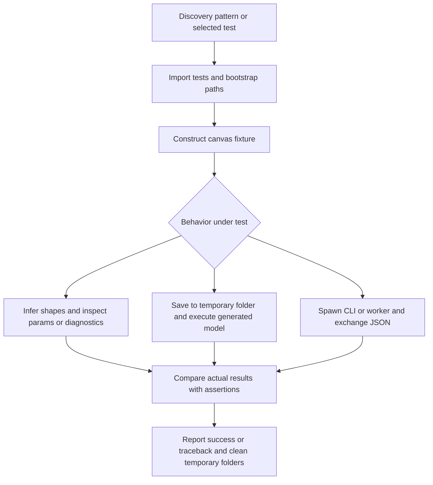

# Utility regression tests

These tests use Python's standard-library `unittest` runner and require PyTorch.
Activate the Python environment containing PyTorch before running them.

| File | Coverage |
| --- | --- |
| `test_codegen.py` | Disconnected layers, package imports, dynamic loading, save CLI |
| `test_shape_inference.py` | Meta tensors, adapters, invalid branches, cycles, nested models, worker protocol |
| `bootstrap.py` | Add the utility and generation directories to the test import path |

## Runtime flow: test selection to verified behavior

**Input:** unittest receives a discovery directory/pattern or a test name. Test
fixtures build canvas dictionaries in Python; no external user model is required.
`bootstrap.py` resolves repository paths from its own location before tests import
the parsing, fitting, and generation modules.



1. The runner discovers `TestCase` methods, or selects the requested class/method.
2. Fixtures create Input/layer nodes and edges. Shape tests call `infer_shapes` or
   `ShapeEngine.infer`, then inspect inferred dimensions, constructor fields, meta
   devices, and diagnostics. Some compare shapes with real PyTorch execution.
3. Save tests create temporary child canvases, call `save_model_to_folder`, load the
   generated Python class, and execute it with real tensors. Assertions check output
   shapes, adapted variants, reload behavior, and preservation of original sources.
4. The compilation-failure test injects an exception into source generation and
   verifies that no parent variant directory was written.
5. CLI/worker tests use `sys.executable` in subprocesses. Requests go through stdin;
   stdout is decoded as JSON. The worker test sends valid, invalid, then valid JSON
   and verifies recovery. CLI/worker checks also run outside the repository directory.
6. Assertions produce `ok`, `FAIL`, or `ERROR` results. The runner exits nonzero for
   unsuccessful tests, and temporary-directory contexts remove generated artifacts.

**Output:** a unittest report, not a production model artifact. For example, the
disconnected-layer regression feeds a canvas with an active ReLU and an unconnected
Linear into source generation, instantiates the generated class, and verifies both
that the Linear attribute exists and that forward output equals the ReLU result.

## Run all tests

In PowerShell, starting at the repository root:

```powershell
Set-Location 'src/Canvas/utils/tests'
python -B -m unittest discover -s . -p 'test_*.py' -v
```

Expected: each test reports `ok`, followed by `OK`. A failure returns a nonzero exit
code. Tests use temporary directories for saved models and start short-lived Python
subprocesses to verify CLI/worker behavior.

## Run each file's main

Both test files provide `if __name__ == '__main__': unittest.main()`:

```powershell
python -B test_codegen.py -v
python -B test_shape_inference.py -v
```

`bootstrap.py` is an import helper, not a runnable test or application entry point.

## Run one regression

From this directory:

```powershell
python -B -m unittest test_codegen.CodeGenerationTests.test_disconnected_module_is_initialized_but_not_called -v
python -B -m unittest test_shape_inference.IntegratedTests.test_worker_handles_multiple_requests_and_recovers_after_invalid_json -v
```

## Troubleshooting

- `python` not found: use the installed interpreter's full path, or replace `python`
  with `py` if the Windows launcher has an interpreter registered.
- `No module named torch`: select the environment with PyTorch. All subprocess tests
  reuse `sys.executable`, so the parent interpreter must be configured correctly.
- `No module named test_codegen`: run the single-test command from this directory.
- Palette-related errors: keep `src/Canvas/data/modules.json` in the repository layout.

See [utility architecture](../document.md) for package responsibilities.
