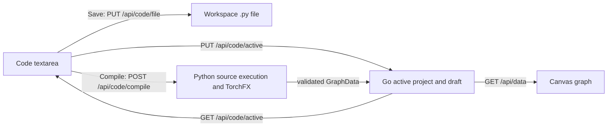

# Code mode: architecture and behavior

Code mode edits workspace Python files and converts supported PyTorch models into editable Canvas graphs. Code and Canvas share one active project in the Go process. Switching modes transfers the current Code buffer into that project's session; it does not save a Python file or compile a graph. **Save**, **Compile**, and **switch mode** are separate operations.

## Ownership and entry points

| Component | Responsibility |
| --- | --- |
| [`mode/mode.go`](mode/mode.go) and [`server/server.go`](server/server.go) | Register `/code`, `/api/code/*`, and `/static/code/*` through Studio; validate Code requests and workspace paths. |
| [`templates/code.html`](templates/code.html), [`static/editor.js`](static/editor.js), [`static/editor.css`](static/editor.css) | Render the lightweight editor, file list, class selector, status, and user actions. The editor is a textarea; there is no editor library. |
| [`../static/studio/navigation.js`](../static/studio/navigation.js) | Wait for pending Canvas edits or Code draft synchronization, then navigate to the selected mode. |
| [`../Canvas/handler/code_document.go`](../Canvas/handler/code_document.go) | Bind a Python path to a project, read/update its draft, and guard against stale project or path updates. |
| [`../Canvas/utils/graph/project.go`](../Canvas/utils/graph/project.go) and [`../Canvas/utils/graph/store.go`](../Canvas/utils/graph/store.go) | Own the active project ID, graph, Code path, and Code draft under the store mutex. |
| [`../Canvas/utils/session/session.go`](../Canvas/utils/session/session.go) | Recover project order, the active project, graphs, Code paths, and Code drafts in desktop sessions. |
| [`utils/compile.py`](utils/compile.py) and [`../Canvas/handler/code_import.go`](../Canvas/handler/code_import.go) | Trace a trusted local `nn.Module`, convert supported FX operations to `GraphData`, validate it, and replace the target Canvas graph. |

The Go store's `CurrentProjectID` is authoritative for both modes and is process-wide, so simultaneous browser clients share the same active project. `CodePath` identifies the file associated with a project. `SourcePath` records the file used for a successful compile. `CodeDraft`, `CodeSavedSource`, and `CodeHash` hold the editor buffer, its last saved baseline, and the file hash used for conflict detection. `CodeDraftSet` distinguishes a synchronized empty buffer from a project that has never loaded Code. A Canvas-only project can therefore carry a draft without having a `.py` path yet.



## User flows

### Enter Code and choose a file

On page load, the editor requests `GET /api/code/active`. Go reads the current project. If that project has a synchronized draft, it returns the draft. Otherwise it reads the associated `.py` file when one exists in the selected workspace. With no associated file, Code opens an empty buffer for the active Canvas project. The editor then lists workspace `.py` files and scans the current buffer for candidate model classes.

Opening an existing file checks that the file can be read, synchronizes the current buffer, calls `POST /api/code/active/bind`, and reloads the active document. Binding selects an existing project for that path. If no project owns the path, it attaches the path to the current project when that project has no Code path; otherwise it creates and activates a new project. Choosing a new filename follows the same binding flow. The file itself is created only when Save succeeds. Switching files preserves each project's synchronized draft.

### Edit, switch modes, and recover

The editor tracks unsaved changes by comparing the textarea value with `savedSource`. An edit followed by an exact revert is clean. Line numbers, Tab indentation, and basic find run locally. Class scanning is delayed after input; it reads the current buffer without executing model source.

Selecting another mode calls `window.prepareModeSwitch`, which sends the current buffer and baseline to `PUT /api/code/active`. The shared navigation code waits for that request before changing pages. The Go handler rejects a stale project ID or a path that no longer belongs to the active project with HTTP 409. On synchronization failure, navigation stays on Code and shows the error. A successful mode switch suppresses the browser's unload warning because the draft is retained. Returning to Code loads the draft from the active Go project. Canvas displays its current graph; changing modes does not transform either representation.

Leaving Code through an unrelated navigation or closing/reloading the page still triggers the browser warning when the textarea differs from `savedSource`. Changing the workspace asks before discarding dirty editor content. Deleting a file requires confirmation; when the editor is dirty, the confirmation states that unsaved edits will be discarded.

Draft synchronization occurs on mode switch, file switch, successful Save, and successful Compile. Keystrokes alone do not send an API request. Desktop sessions persist synchronized drafts, which may contain unsaved source code, in `userData/session-v1.json` through the debounced session writer and flush on graceful shutdown. A development server started with `go run .` retains drafts in memory while that process runs; session persistence requires `EIN_THEATER_DATA_DIR`.

### Save a Python file

Save sends the textarea snapshot to `PUT /api/code/file` with the last observed SHA-256 `expectedHash`. Go writes only a relative `.py` path inside the selected workspace. For an existing file, a missing or mismatched hash returns HTTP 409 instead of overwriting an external edit. For a new file, `expectedHash` is empty and the file must not already exist. After a successful write, the editor advances its saved baseline and synchronizes the latest buffer into the active project. Edits made while the write is in progress remain dirty because the baseline is the submitted snapshot.

### Compile into Canvas

Compile uses the textarea content, including unsaved changes. It requires a selected model class and does not call Save. If the target project already has a compiled graph or graph edits, the UI asks for replacement; the API independently enforces `replace: true` and returns HTTP 409 otherwise.

Go launches the configured Python runtime with the converter script, source text, class name, and file path. The converter executes the trusted source, constructs the class with no arguments, and calls `torch.fx.symbolic_trace`. After conversion, Go validates the returned nodes and edges. It then replaces the associated project's graph under the store mutex, updates its source association, resets graph history, makes the project active, synchronizes the Code draft, and opens Canvas. A syntax, runtime, trace, unsupported-operation, timeout, or graph-validation failure leaves the existing graph unchanged. Replacing a graph discards its prior Canvas node edits after confirmation.

The generated graph contains topology and recoverable layer constructor parameters. It does not include trained weights and does not provide source-code round trips from Canvas edits. Canvas serves compiled graphs as snapshots without automatic shape fitting, so inferred dimensions cannot silently rewrite the imported structure.

## HTTP contract

All Code errors use JSON `{ "error": "..." }`. Paths in requests and responses are relative to the active workspace unless explicitly described as internal Go project fields.

The `projectId` field on `GET /api/code/file` reports an existing **compiled** association for that file. The authoritative active project ID comes from `GET /api/code/active`.

| Route | Request | Success | Main failures |
| --- | --- | --- | --- |
| `GET /api/code/files` | No body | `{files:[...]}` for workspace `.py` files | 400 without workspace; 500 on traversal error |
| `GET /api/code/file?path=...` | Relative `.py` path | `{path,source,hash,projectId}` | 400 invalid or missing path; 413 over 1 MiB |
| `PUT /api/code/file` | `{path,source,expectedHash}` | `{path,hash}` | 400 invalid input/path; 409 external change; 413 over 1 MiB |
| `DELETE /api/code/file` | `{path,expectedHash}` | `{deleted:true}` | 400 invalid or missing path; 409 external change |
| `GET /api/code/active` | No body | `{projectId,projectName,path,source,savedSource,hash,replaceRequired}` | Returns an empty path if the project has no valid path in the selected workspace |
| `PUT /api/code/active` | `{projectId,path,source,savedSource,hash}` | `{synced:true}` | 400 invalid path or draft over 1 MiB; 409 stale project/path |
| `POST /api/code/active/bind` | `{path}` | `{projectId,replaceRequired}` | 400 invalid path or missing workspace |
| `POST /api/code/classes` | `{path,source}` | `{classes:[...]}` | 400 invalid input/path; 422 syntax error; 503 missing Python runtime |
| `POST /api/code/compile` | `{path,source,className,replace}` | `{projectId,updated,nodeCount,edgeCount}` | 400 invalid input; 403 non-loopback caller; 409 replacement required; 422 conversion failure; 503 missing Python/PyTorch |

The file and Code endpoints reject absolute paths, `..` traversal, non-`.py` extensions, and symlink paths. Input source is capped at 1 MiB. File listing skips hidden directories and sorts the result. The compile endpoint additionally requires a loopback client. In desktop mode, the Go sidecar requires Electron's per-run `X-Ein-Theater-Token` on every request; browser development does not use that token.

## FX conversion contract

The converter discovers top-level classes inheriting directly or indirectly from `Module`, `nn.Module`, or `torch.nn.Module` by parsing Python syntax. The selected class must be an `nn.Module` constructible without arguments. Source execution is intentional and is restricted to trusted local files. Conversion has a 30-second process timeout.

| FX operation | Canvas representation |
| --- | --- |
| `placeholder` | `Input` node, including input name |
| Supported `call_module` | Palette `nn.<module>` node with recoverable constructor parameters |
| `operator.add` / `torch.add` | `torch.add` node with two inputs |
| `torch.cat` | `torch.cat` node with integer `dim` |
| Integer `operator.getitem` | `operator.getitem` node with `index` |

Each FX node becomes a Canvas node; input dependencies become directed edges. Initial positions use dependency depth for the X coordinate and a row counter for Y. The converter requires one tensor output and rejects unused branches, multiple outputs, unsupported modules, unsupported FX calls, or arguments it cannot represent. Errors identify the unsupported FX node or operation where possible. The supported `nn` set comes from the Canvas module palette; the converter does not silently drop operations.

## Verification and maintenance

From the repository root:

```powershell
cd desktop
npm.cmd test
```

This runs Go tests, Code editor behavior tests, Studio navigation tests, Canvas JavaScript tests, and desktop resource checks. Focused checks from `src/`:

```powershell
go test ./Code/server ./Canvas/handler ./Canvas/utils/session
node Code/static/editor.test.mjs
node static/studio/navigation.test.mjs
python -m unittest Code/utils/test_compile.py
```

Python tests that require PyTorch skip when it is unavailable. For a manual end-to-end check, select a workspace, create a Code file, edit it without saving, switch to Canvas and back, and verify the same draft and active project. Save and reopen the file, then compile an `Input → Linear → ReLU` model, inspect nodes and parameters in Canvas, switch back, and verify the Code buffer. Repeat after editing Canvas nodes to confirm replacement before recompilation; verify that a failed compile leaves that graph intact. In desktop, restart the app after a synchronized mode switch and verify session recovery.

The desktop package includes the Code page, scripts, converter, Canvas palette, Go sidecar, and offline UI assets. Python and PyTorch must be installed separately. See the [desktop guide](../../desktop/document.md) for build and packaging steps.
