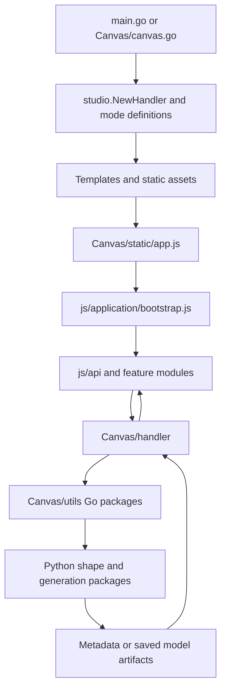

# Source map and execution flow

The [global code-flow guide](../document.md) is the project-wide architecture
reference. It explains startup, state ownership, graph editing, asynchronous shape
analysis, Python generation, save/load, concurrency and end-to-end tests.

See [studio registration and expansion](studio/document.md) for adding Data and Debug or extending the developing Code mode. Shared Go resources live in [utils](utils/document.md); Canvas exports its [mode adapter](Canvas/mode/document.md). The [desktop shell](../desktop/document.md) starts this source as an authenticated Windows sidecar.

## Read the source in runtime order

| Source area | Input | Output / role |
| --- | --- | --- |
| `main.go` | Environment, explicit resource/data directories, and launch mode | Studio server with Canvas routes; random loopback port and token authentication in desktop mode. |
| `Canvas/canvas.go` | Environment and launch directory | Standalone Canvas server. |
| [templates](templates/document.md) | Future shared shell resources | Mode-owned editor HTML stays with its mode. |
| [static](static/document.md) | Asset requests | Shared styles. |
| [Canvas templates](Canvas/templates/document.md) | Canvas/sidebar fragments | Canvas page and UI mount points. |
| [Canvas frontend](Canvas/static/js/document.md) | User events and graph responses | Rendered canvas, API mutations and metadata refresh. |
| [HTTP handlers](Canvas/handler/document.md) | HTTP requests | Validated utility calls and responses. |
| [Categorized utilities](Canvas/utils/document.md) | Graph commands, paths and snapshots | Graph state, file IO, HTML composition and Python orchestration. |
| [Session recovery](Canvas/utils/session/document.md) | Electron user-data directory and store mutations | Desktop project/workspace snapshots and restore. |
| [Code mode](Code/document.md) | Active model, Python source and workspace files | Draft editing, file Save and supported PyTorch-to-Canvas compilation. |
| [Python shape analysis](Canvas/utils/auto_shape_fitting/document.md) | Canvas and base directory | Fitted parameters, tensor diagnostics and adapted submodels. |
| [Python generation](Canvas/utils/generate%20code/document.md) | Validated canvas/computational graph | Model JSON and executable Python source. |

## Main call paths

- **First render:** `main` → route registration → page composition → `app.js` →
  `initApp` → `loadGraph` → `/api/data?analyze=false` → render datasets → background analysis.
- **Edit:** feature event → API wrapper → matching handler → `utils/graph`
  operation under `Store.Mu` → response → UI update.
- **Analyze:** shape-refresh scheduler → `DataHandler` → detached snapshot →
  Go Python bridge → shape worker → guarded metadata reconciliation → dataset update.
- **Save:** `saveActiveModel` → `SaveModelHandler` → snapshot → generation subprocess
  → infer/validate → canvas conversion → FX/source rendering → artifact writes → UI refresh.
- **Load:** `loadModelFromFolder` → `LoadModelHandler` → `modelio.Load` →
  `Store.ImportGraph` → associate the model's `.py` file → project/graph refresh.
- **Code:** select the shared active project → load its bound `.py` or draft →
  Save to a workspace file or Compile a supported class into the same Canvas project.
- **Open workspace:** `chooseWorkspace` → Electron directory dialog (or Windows
  development fallback) → `/api/workspace/set` → sidebar refresh.
- **Desktop recovery:** `ConfigurePersistence` → session load → debounced mutation
  writes → flush when the sidecar shuts down.

Run `go run .` here for studio mode or from `Canvas` for standalone mode. Run
`go test ./...` and `go vet ./...` here. The global guide contains frontend/Python
commands, expected outcomes and the manual test sequence for the complete flow.

## Studio presentation

The UI separates application mode navigation from model commands. Shared visual tokens and responsive component styles live in `static/styles`; Canvas owns its graph rendering and page markup. Electron adds a frameless titlebar with custom window controls through shared Studio code. See [the visual system and UI verification guide](static/styles/document.md#studio-visual-system) for inputs, outputs, ownership, and manual checks.
